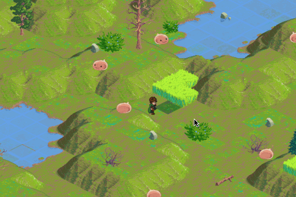

Isometric RPG
===

Attempt to create simple old-school isometric multiplayer RPG using modern Scala technologies.



Tech stack:

* [Scala](http://www.scala-lang.org/)
* [Xitrum Web Framework](https://github.com/xitrum-framework/xitrum)
* [Akka](http://akka.io/)
* [Phaser JS](http://phaser.io/)
* [Phaser Isometric Plugin](http://rotates.org/phaser/iso/)


To run
===

* Checkout this repo
* Type: ``` sbt/sbt run ``` in project directory
* Open http://localhost:8080/


To generate Eclipse or IntelliJ project:
===

```
  sbt/sbt eclipse
  sbt/sbt gen-idea
```

[more info about using xitrum](https://xitrum-framework.github.io/guide/3.22/singlehtml/en/index.html#import-the-project-to-intellij)
